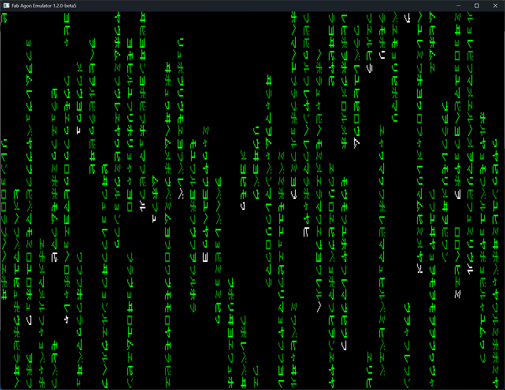

# Matrix
Agon implementation of a Matrix movie style character display, based on Chris Allegretta's 1999 version at https://github.com/astyfoo/cmatrix

Help is available using the `-h` option from the command line.

While running, you can use the `1`-`9` keys to change the colour of the display, the `a` key toggles asynchronous mode, and finally `q` or `<esc>` to quit.

# Build notes
I've included a cut down version of `get_opt.h` which still issues 3 warnings, however, it is sufficient to work as-is.

# Screenshots

